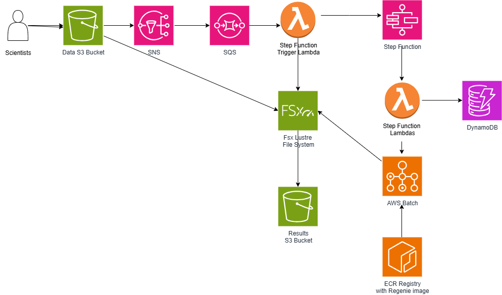

# AWS GWAS Workflow Automation

This project implements an automated genomics workflow system for GWAS (Genome-Wide Association Studies) using AWS services and the CDK (Cloud Development Kit) in TypeScript and Python Lambda functions. The architecture is based on the [AWS Architecture Blog post on automated genomics workflows](https://aws.amazon.com/blogs/architecture/automated-launch-of-genomics-workflows/).

## Architecture Overview

The solution orchestrates genomics workflows using the [regenie](https://github.com/rgcgithub/regenie) software (Mbatchou, J., Barnard, L., Backman, J. et al. Computationally efficient whole-genome regression for quantitative and binary traits. Nat Genet 53, 1097–1103 (2021). https://doi.org/10.1038/s41588-021-00870-7) with the following AWS services:

- **AWS Step Functions** for workflow orchestration with error handling
- **AWS Lambda** for serverless compute and workflow initialization
- **AWS Batch** for distributed processing of genomic data
- **Amazon FSx for Lustre** for high-performance file access
- **Amazon S3** for data storage
- **Amazon SQS** for reliable message processing
- **Amazon SNS** for notifications
- **Amazon DynamoDB** for workflow and study metadata tracking
- **Amazon CloudWatch** for monitoring and logging
- **Amazon ECR** for container image storage

## Data Flow Architecture




## Getting Started

### Prerequisites

- Node.js 14.x or later
- AWS CDK CLI
- AWS CLI configured with appropriate permissions
- Docker (for local testing)

### Installation

1. Clone this repository
```
git clone https://github.com/your-org/aws-gwas.git
cd aws-gwas
```

2. Install dependencies
```
npm install
```

3. Install CDK dependencies
```
cd cdk
npm install
cd ..
```

4. Bootstrap CDK (if not already done)
```
cd cdk
cdk bootstrap
```

5. Deploy all infrastructure stacks
```
cdk deploy --all
```

This will deploy all 8 stacks in the correct dependency order:
- GwasNetworkStack (VPC and networking)
- GwasStorageStack (S3 and FSx)
- GwasDatabaseStack (DynamoDB tables)
- GwasComputeStack (Batch and ECR)
- GwasLambdaStack (Lambda functions)
- GwasWorkflowStack (Step Functions)
- GwasQueueProcessingStack (SQS and manifest processing)
- GwasMonitoringStack (CloudWatch alarms and dashboard)


## Using the Manifest-Based Trigger System

### How to Use

#### 1. Upload Data Files

First, upload your genomic data files to an S3 path:

- For PLINK BED format: Upload `.bed`, `.bim`, and `.fam` files
- For PLINK2 PGEN format: Upload `.pgen`, `.pvar`, and `.psam` files
- For BGEN format: Upload `.bgen` and `.sample` files

Also upload any phenotype files and covariate files as needed.

Example:
```
s3://your-data-bucket/experiments/experiment-123/
  ├── example.bed
  ├── example.bim
  ├── example.fam
  ├── phenotype_bin.txt
  └── covariates.txt
```

#### 2. Create a Manifest File

Create a JSON manifest file with the required information:

At minimum, the manifest must include:
- `experimentId` - A unique identifier for your experiment
- `s3Path` - The S3 path where your genomic data files are stored
- `inputData` - Information about your input files

Example minimal manifest:
```json
{
  "experimentId": "experiment-123",
  "s3Path": "s3://your-data-bucket/experiments/experiment-123/",
  "inputData": {
    "format": "bed",
    "filePrefix": "example"
  }
}
```

#### 3. Upload the Manifest File

Upload your manifest file to the same S3 location as your data files. The file should be named:
- `manifest.json` or 
- `anything.manifest.json` 

For example:
```
s3://your-data-bucket/experiments/experiment-123/manifest.json
```

#### 4. Automatic Workflow Triggering

When the manifest file is uploaded, the system will:

1. Detect the manifest upload via S3 event notifications
2. Validate the manifest contents
3. Check that all required data files exist
4. Start the Step Functions workflow

You'll receive notifications about the workflow status via SNS (if subscribed).

## Usage for Scientists

Scientists can initiate genomics workflows through:

1. Uploading a manifest file to S3 to automatically trigger the workflow
2. Direct interaction with Step Functions API via AWS Console
3. AWS CLI by running `start-execution` and passing a JSON input file
4. The provided `upload_and_run.py` script for quick testing with example data

### Example input parameters:

```json
{
  "studyId": "study-123456",
  "datasetId": "dataset-abcdef",
  "sampleSize": 1000,
  "batchSize": 100,
  "regenieVersion": "latest",
  "startStep": "1",
  "datasetPath": "s3://genomics-data/dataset1",
  "phenotype": "diabetes",
  "samples": [
    {
      "sampleId": "sample-001",
      "diabetes": "0",
      "gender": "F",
      "age": "45"
    },
    {
      "sampleId": "sample-002",
      "diabetes": "1",
      "gender": "M",
      "age": "52"
    }
  ],
  "sampleManifest": "s3://genomics-data/manifests/study-123456-samples.csv"
}
```

### Key Data Flow Steps:

1. **Data Upload & Trigger**: Genomic data files and manifest are uploaded to S3, triggering the workflow
2. **Manifest Processing**: S3 event → SNS → SQS → Lambda validates manifest and starts Step Functions
3. **Workflow Initialization**: Creates workflow record in DynamoDB and validates parameters
4. **Job Calculation**: Analyzes input data to determine required Batch jobs and chromosomes
5. **Step 1 Processing**: Single Batch job builds prediction models using all genomic data
6. **Step 2 Processing**: Parallel Batch jobs perform association testing by chromosome
7. **Results Storage**: Outputs stored in S3 results bucket and FSx for Lustre
8. **Status Tracking**: All workflow and job statuses tracked in DynamoDB tables
9. **Monitoring**: CloudWatch provides real-time monitoring and alerting

### Data Movement Patterns:

- **S3 → FSx**: Genomic data automatically imported to high-performance filesystem
- **FSx → Batch**: Jobs read from and write to FSx for optimal performance
- **Batch → S3**: Results automatically exported back to S3 for persistence
- **Lambda → DynamoDB**: All workflow metadata and status updates
- **Step Functions → Batch**: Orchestration with .sync integration for job monitoring

## REGENIE Workflow Implementation

The workflow implements a GWAS analysis pipeline using the REGENIE software, which operates in two primary steps:

### Direct FSx for Lustre and S3 Integration
- The workflow uses a persistent FSx for Lustre filesystem for high-performance access
- The StorageStack configures the FSx for Lustre file system with auto-import settings for the S3 data bucket
- This approach simplifies the architecture and eliminates potential circular dependencies

### Manifest-Based Workflow Trigger System
- The system automatically starts GWAS workflows when manifest files are uploaded to S3
- S3 bucket sends notifications to an SNS topic when JSON files are uploaded
- The SNS topic forwards messages to an SQS queue for reliable processing
- A Lambda function consumes SQS messages, validates manifest files, and triggers the Step Functions workflow
- The system filters specifically for files named `manifest.json` or ending with `.manifest.json`

### Step 1: Model Building
- Single job that processes all input data to build prediction models
- Outputs a prediction file (e.g., `step1_out_pred.list`) with model coefficients
- Required for accurate association testing in Step 2
- Runs as a single AWS Batch job (no parallelization)

### Step 2: Association Testing
- Multiple parallel jobs split by chromosome for efficient processing
- Each chromosome analysis runs independently as a separate AWS Batch job
- References the prediction file created in Step 1
- Outputs chromosome-specific results for downstream analysis

### Dynamic Chromosome Detection
- The workflow automatically detects chromosomes from input BIM files
- Supports non-human organisms with different chromosome structures
- No hardcoded chromosome assumptions (vs. traditional 22 autosomes + X, Y approach)

### Step Functions State Machine
The workflow state machine orchestrates the entire process:

1. **Workflow Initialization**: Sets up workflow ID and parameters
2. **Job Calculation**: Determines required jobs based on the input dataset
   - For Step 1: Creates a single model-building job
   - For Step 2: Creates multiple chromosome-specific jobs
3. **Step Selection**: Determines whether to run Step 1 + Step 2 or only Step 2
   - When `startStep=1`: Runs both steps sequentially, ensuring Step 2 has access to Step 1 outputs
   - When `startStep=2`: Skips Step 1, assumes prediction files already exist
4. **Job Submission and Monitoring**: Submits appropriate Batch jobs and tracks execution
5. **Results Processing**: Handles successful completion via Success Handler Lambda
   - Updates workflow status to COMPLETED in DynamoDB
   - Stores final job statistics and completion metadata
   - Provides results location for downstream processing

### Parameter Flow
- **Step 1 to Step 2 Connection**: The prediction file path (`*_pred.list`) is automatically passed from Step 1 outputs to Step 2 jobs
- **Covariates Handling**: Covariates are optional and passed correctly to both steps if specified
- **Command Building**: The workflow generates complete REGENIE commands with all required parameters for both steps

### Error Handling
- Comprehensive job failure detection
- Structured error reporting to DynamoDB
- Automatic workflow status updates on both success and failure

### Shared Utilities
- **DynamoDB Utilities** (`lambdas/shared/dynamodb_utils.py`): Reusable functions for workflow and job status management
- **S3 Utilities** (`lambdas/shared/s3_utils.py`): Common S3 operations like file existence checks and URI parsing

## Project Goals

1. Automate regenie workflows for GWAS studies
2. Enable scientists to focus on research rather than infrastructure management
3. Provide scalable compute resources for genomic analysis
4. Implement comprehensive error handling and monitoring
5. Create a system that can be extended to other genomic workflows

## Key Features

### Main Workflow Components

- **Persistent FSx for Lustre Filesystem**: Direct S3 integration with auto-import capabilities
- **Manifest-Based Trigger System**: Workflow automatically starts when manifest files are uploaded to S3
- **Dynamic Command Generation**: Commands for regenie steps are built at runtime based on input parameters
- **Parallel Job Processing**: AWS Batch is used to scale out computational steps horizontally
- **Error Handling**: Comprehensive error detection, reporting, and recovery
- **Study Tracking**: Full study metadata and execution tracking via DynamoDB

### Stack Architecture

The infrastructure is organized into eight well-defined stacks that deploy together to create the complete GWAS workflow system:

1. **NetworkStack**: 
   - VPC with public, private, and isolated subnets across 2 availability zones
   - Security groups for FSx and Batch communication with proper Lustre protocol ports (988, 1018-1023)
   - NAT Gateway for outbound internet access from private subnets

2. **StorageStack**: 
   - S3 buckets for genomic data and analysis results with lifecycle policies
   - FSx for Lustre filesystem with direct S3 integration and auto-import capabilities
   - SNS topic for manifest file upload notifications

3. **DatabaseStack**:
   - DynamoDB WorkflowTable for tracking workflow executions and status
   - DynamoDB JobStatusTable for tracking individual batch job progress
   - Global Secondary Indexes for querying by status, user, study, and creation time

4. **ComputeStack**:
   - AWS Batch compute environments and job queues for scalable genomics processing
   - Job definitions for regenie container execution
   - ECR repository for storing the regenie Docker image

5. **LambdaStack**:
   - Workflow initialization function for parameter validation and setup
   - Job calculator function for determining required batch jobs from input data
   - Command parser function for building regenie commands dynamically
   - Success handler function for workflow completion management
   - Error handler function for workflow failure management
   - All functions with properly scoped IAM roles and VPC integration

6. **WorkflowStack**:
   - Step Functions state machine for orchestrating the complete GWAS analysis pipeline
   - IAM roles with least-privilege permissions for state machine execution
   - Integration with Batch for .sync execution patterns

7. **QueueProcessingStack**:
   - SQS queue that subscribes to the manifest notification SNS topic
   - Dead-letter queue for failed message processing with configurable retry policies
   - Manifest processor Lambda function that validates manifest files and triggers workflows
   - Workflow notification topic for status updates

8. **MonitoringStack**:
   - CloudWatch alarms for Lambda function errors, Step Functions failures, and Batch job failures
   - Comprehensive dashboard showing critical workflow metrics
   - SNS topic for alarm notifications with optional email subscriptions
   - Custom metrics and monitoring for all workflow components

### Database Schema

The system uses two core DynamoDB tables to track genomics workflows:

1. **WorkflowTable**: Records workflow executions with runtime parameters and execution status
2. **JobStatusTable**: Tracks individual batch job statuses within workflows

### Cleanup Workflow

A separate state machine handles cleanup of resources:
1. Checks for pending failures in DynamoDB
2. Verifies if there are running Step Functions executions
3. Makes decisions about cleaning up resources
4. Updates workflow status based on execution results

## Lambda Functions

The following Lambda functions are used in the workflow:

1. **Manifest Trigger** (`manifest_trigger`): Processes SQS messages from manifest file uploads and validates manifest files before initiating Step Functions workflows.

2. **Workflow Initialization** (`workflow_init`): Initializes the workflow, validates input parameters, and sets up the workflow execution context.

3. **Job Calculator** (`job_calculator`): Analyzes input genomic data to calculate and determine the required batch jobs based on chromosomes and analysis parameters.

4. **Command Parser** (`command_parser`): Parses and formats regenie commands for AWS Batch execution.

5. **Success Handler** (`success_handler`): Processes successful workflow completion, updates final workflow status to COMPLETED in DynamoDB, and stores completion metadata.

6. **Error Handler** (`error_handler`): Handles workflow failures, updates job and workflow statuses in DynamoDB, and determines final workflow state based on failure patterns.

## Monitoring and Error Handling

- CloudWatch dashboards provide real-time metrics on workflow performance
- Failed jobs are logged to DynamoDB for easy access and management
- Error notifications can be configured via SNS or email
- The cleanup workflow automatically detects and handles pending failures
- Study status is updated automatically based on workflow execution results


## Acknowledgments

- AWS Genomics team for architecture guidance
- REGENIE project for the genomic analysis software

## TODOs

### Chromosome Detection Improvements
- [ ] **Support all genomic formats**: Currently only BED/PLINK (.bim) format supported for chromosome detection
  - [ ] Add PGEN format (.pvar file parsing)
  - [ ] Add VCF format (header parsing) 
  - [ ] Add BGEN format support
- [ ] **Large file handling**: Lambda 10GB ephemeral storage limit will fail on large GWAS datasets
  - [ ] Implement Batch job for chromosome detection on files >8GB
  - [ ] Implement Fargate task as alternative to Batch
  - [ ] Auto-fallback from Lambda to Batch/Fargate based on file size
- [ ] **Compressed file support**: Handle .gz, .bz2 compressed genomic files properly
- [ ] **Fail-fast validation**: Remove hardcoded chromosome fallbacks, require successful detection

### Architecture Improvements  
- [ ] **Split Lambda 3**: Separate chromosome detection from job orchestration
- [ ] **Add retry logic**: Exponential backoff for S3 downloads and DynamoDB writes
- [ ] **FSx validation**: Verify FSx mount paths exist before job creation